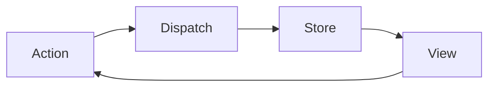
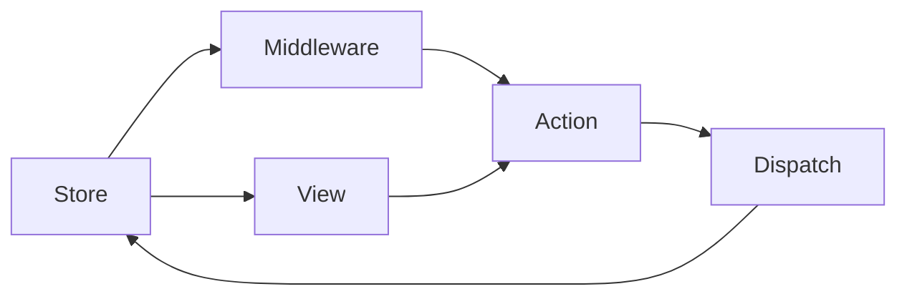
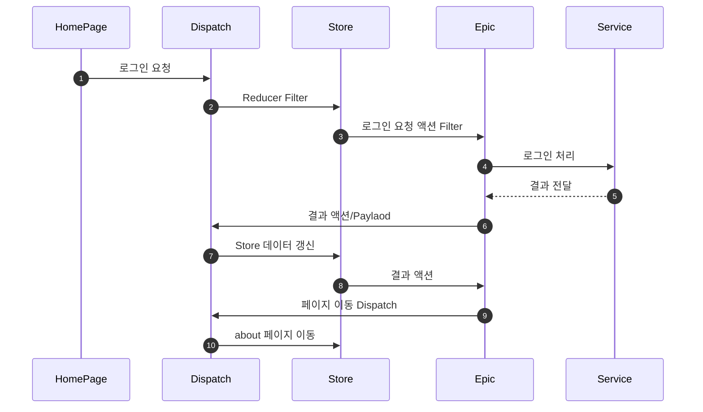

`Redux` 를 실무에서 사용하다보면 `Middleware`에 기능을 상당히 많이 사용하게 됩니다.

`Middleware` 를 많이 사용하는 이유는 간단하게 아래 Flowchart 구성대로면,
`Store` 는  `View` 에게 전달하고,  `View`는 다시 `Action` 을 호출한다.
즉,  `View`  = `Controller` 가 되는 대 참사가 됩니다. 





### 매우 안좋은 코드 예

Redux `Store` 에 Login 정보가 변경되는 상태를 `View` 내부에서 `useEffect`를 이용해 상태를 확인해 다른 페이지로 변경한다.

```jsx
// #####################################
// #### 매우 안좋은 코드  매우 안좋은 코드  ####
// #####################################

import React, { useEffect } from 'react';
import { useDispatch, useStore } from 'react-redux';
import { useHistory } from 'react-router';

export const BadCodeComponent = () => {
  const history = useHistory();
  const [id, setID] = useState();
  const [pw, setPW] = useState();

  const dispatch = useDispatch();
  const isLogin = useStore((store) => store.auth.isLogin);

  const onSubmit = (e) => {
    e.preventDefault();
    dispatch(login(id, pw));
  };

  useEffect(() => {
    if (isLogin) {
      history.replace('/')
    }
  }, [isLogin]);

  return (
    <div>
      <form onSubmit={onSubmit}>
        <input type="text" value={id} onChange={(e) => setID(e.target.value)} />
        <input
          type="password"
          value={pw}
          onChange={(e) => setPW(e.target.value)}
        />
      </form>
    </div>
  );
};

```

> View에서 전역 상태를 체크해 관리하는 코드는 매우 안좋습니다.


## Middleware를 사용해서 제대로 만들기

복잡해 보이는 구조이지만, 실제 설정이 완료된 이후 개발을 진행한다면 확장, 관리 측면에서 매우 좋습니다.



1. 로그인 요청
2. 로그인 완료
3. about 페이지 이동




### 1. Package 설치

```bash
yarn add redux-observable rxjs
```

* [redux-observable](https://redux-observable.js.org/) : 비동기 처리, 미들웨어 설정, Epic 생성
* [rxjs](https://rxjs.dev/) : Reactive Programming 에 대표적인 라이브러리


## 2. 코드 작성 -Service,Redux(Epic,Middleware)

### 2-1. Type 추가

`src/@types/common.d.ts` 전체에서 사용할 Type 지정

```typescript
declare global {
  /**
   * 로그인 완료 Response Body
   */
  interface LoginResponseBody {
    token: string;
    isLogin: boolean;
  }
  /**
   * 로그인 Request Body
   */
  interface LoginRequestBody {
    id: string;
    password: string;
  }
}

export {};

```


### 2-2. Service 추가

```
.
├── Services
│   ├── index.ts
│   ├── src
│   │   └── authService.ts
│   └── types.d.ts
```


##### `src/Services/src/authService.ts` : 로그인 `async` 추가

```typescript
// Example 코드입니다. Promise API 등을 연결하는 용도
export const login = (
  loginRequestBody: LoginRequestBody
): Promise<LoginResponseBody> => {
  return new Promise<LoginResponseBody>((resolve) => {
    const { id, password } = loginRequestBody;
    setTimeout(() => {
      resolve({ isLogin: true, token: `example-${id}-${password}` });
    }, 500);
  });
};
```


###### `src/Services/index.ts` : 내보내기

```typescript
import * as authService from './src/authService';

const Default = {
  authService,
};

export default Default;

```


##### `src/Services/types.d.ts` :  `typesafe-actions` 에 Service type 추가

>  이 부분은 필수 항목은 아닙니다. 단지 개발을 쉽게 하기 위해 작성했습니다.

```typescript
import {} from 'typesafe-actions';

declare module 'typesafe-actions' {
  export type Service = typeof import('./index').default;
}
```


### 2-3. Action,Reducer 추가

```
├── Redux
│   ├── index.ts
│   └── src
│       ├── actions
│       │   ├── index.ts
│       │   └── src
│       │       └── auth.action.ts
│       ├── reducers
│       │   ├── index.ts
│       │   └── src
│       │       └── auth.reduce.ts
│       ├── store.ts
│       └── type.d.ts
```


##### `src/Redux/src/actions/src/auth.action.ts` : `Async` Action 생성

```typescript
import { createAsyncAction } from 'typesafe-actions';

export const requestLogin = createAsyncAction(
  '@@LOGIN/LOGIN/REQUEST', // 요청
  '@@LOGIN/LOGIN/SUCCESS', // 성공
  '@@LOGIN/LOGIN/FAIL' // 실패
)<
  // 요청 타입
  LoginRequestBody,
  // 성공 타입
  LoginResponseBody,
  // 실패 타입
  number
>();
```


##### `src/Redux/src/actions/index.ts` :  Action 내보내기

```typescript
import { routerActions } from 'connected-react-router';
import * as authActions from './src/auth.action';

const Default = {
  routerActions,
  authActions,
};

export default Default;

```


##### `src/Redux/src/reducers/src/auth.reducer.ts` : Reducer 추가

```typescript
import { createReducer } from 'typesafe-actions';
import produce from 'immer';
import $Actions from '../../actions';

type LoginStore = {
  isLogin: boolean;
  count: number;
};

const loginReducer = createReducer<LoginStore>({
  isLogin: false,
  count: 0,
}).handleAction(
  $Actions.authActions.requestLogin.success,
  (state, { payload }) => {
    const { isLogin } = payload;
    return produce(state, (draft) => {
      draft.isLogin = isLogin;
    });
  }
);

export default loginReducer;
```


##### `src/Redux/src/reducers/src/index.ts` :  Reducer 내보내기

```typescript
import { connectRouter } from 'connected-react-router';
import { createBrowserHistory } from 'history';
import { combineReducers } from 'redux';
import auth from './src/auth.reducer';

export const history = createBrowserHistory();

const rootReducer = combineReducers({ router: connectRouter(history), auth });

export default rootReducer;

```


### 2-4. Epic 추가

```
├── Redux
│   ├── index.ts
│   └── src
│       ├── actions
│       │   ├── index.ts
│       │   └── src
│       │       └── auth.action.ts
│       ├── epics
│       │   ├── index.ts
│       │   └── src
│       │       └── auth.epic.ts
```


##### `src/Redux/src/epics/src/auth.epic.ts` : auth epic 추가

```typescript
import { CallHistoryMethodAction } from 'connected-react-router';
import { LocationDescriptorObject } from 'history';
import { Epic } from 'redux-observable';
import { catchError, filter, from, map, of, switchMap, tap } from 'rxjs';
import { isActionOf, RootAction, RootState, Service } from 'typesafe-actions';
import actions from '../../actions';

/**
 * 로그인 액션이 온다면 service에 login을 요청한다.
 * @param action$ 
 * @param store$ 
 * @param service$ 
 * @returns 
 */
export const requestLoginEpic: Epic<
  RootAction,
  RootAction,
  RootState,
  Service
> = (action$, store$, service$) =>
  action$.pipe(
    // 로그인 request 액션 구분 filter
    filter(isActionOf(actions.authActions.requestLogin.request)),
    switchMap(({ payload }) =>
      // 서비스에 로그인 요청
      from(service$.authService.login(payload)).pipe(
        // 성공시 로그인 성공 액션 발생
        map(actions.authActions.requestLogin.success),
        // 실패시 로그인 실패 액션 발생
        catchError((e: Error) => {
          console.log(e.message);
          return of(actions.authActions.requestLogin.failure(401));
        })
      )
    )
  );

/**
 * 로그인 완료 된 이후 이동할 페이지 설정
 * @param action$
 * @returns
 */
export const pageLoginEpic: Epic<
  RootAction,
  CallHistoryMethodAction<[LocationDescriptorObject<unknown>]>,
  RootState,
  Service
> = (action$) =>
  action$.pipe(
    // 로그인 성공 액션 구분 filter
    filter(isActionOf(actions.authActions.requestLogin.success)),
    // 로그인 성공 액션을 발생한 이후 페이지 이동 액션 발생
    map(() =>
      actions.routerActions.replace({
        pathname: '/about',
      })
    )
  );

```


`src/Redux/src/epics/index.ts` : epic 내보내기

```typescript
import { combineEpics } from 'redux-observable';
import * as authEpic from './src/auth.epic';

export default combineEpics(...Object.values(authEpic));
```


##### 2-5. Store Middleware 추가 

위에서 새로 추가한 `Epic` 과 `Service` 를 Store에 추가해준다.

```typescript
import { routerMiddleware } from 'connected-react-router';
import { applyMiddleware, compose, createStore, PreloadedState } from 'redux';
import { createEpicMiddleware } from 'redux-observable';
import { RootAction, RootState, Service } from 'typesafe-actions';
import reducer, { history } from './reducers';
import services from '../../Services';
import epics from './epics';

declare global {
  interface Window {
    __REDUX_DEVTOOLS_EXTENSION_COMPOSE__?: typeof compose;
  }
}

const initialState: PreloadedState<RootState> = {};

// Redux Devtools 연결
const composeEnhancers =
  (process.env.NODE_ENV === 'development' &&
    window &&
    window.__REDUX_DEVTOOLS_EXTENSION_COMPOSE__) ||
  compose;

/**
 * Epic Middleware 생성
 */
export const epicMiddleware = createEpicMiddleware<
  RootAction,
  RootAction,
  RootState,
  Service
>({
  dependencies: services, // 서비스 추가
});

const middlewares = [epicMiddleware, routerMiddleware(history)];

const enhancer = composeEnhancers(applyMiddleware(...middlewares));

const store = createStore(reducer, initialState, enhancer);
// epic 실행
epicMiddleware.run(epics);

export default store;
```


### 3. 코드작성 Page

3-1. `src/Pages/src/HomePage.tsx` 

1. 로그인이 `false` 라면 로그인 창을 보여준다.
2. 로그인 입력시 `Action` 을 보낸다.
3. 로그인 완료시 `true` 로그인 성공을 표기한다.

```tsx
// src/Pages/src/HomePage.tsx
import React from 'react';
import { $Action, useDispatch } from '~/Redux';
import { useSelector } from '~/Redux';

const LoginForm = () => {
  const dispatch = useDispatch();

  const onSubmit = (
    e: Parameters<Required<React.HTMLProps<HTMLFormElement>>['onSubmit']>[0]
  ) => {
    e.preventDefault();
    const data = new FormData(e.currentTarget);
    const id = String(data.get('id'));
    const password = String(data.get('password'));

    dispatch(
      $Action.authActions.requestLogin.request({
        id,
        password,
      })
    );
  };

  return (
    <form onSubmit={onSubmit}>
      <input name="id" placeholder="id" />
      <br />
      <input name="password" placeholder="password" type="password" />
      <br />
      <button type="submit">Submit</button>
    </form>
  );
};
const HomePage = () => {
  const isLogin = useSelector(({ auth }) => auth.isLogin);

  return (
    <div>
      <h1>Home Page</h1>
      {isLogin ? <div>로그인 성공</div> : <LoginForm />}
    </div>
  );
};

export default HomePage;

```

